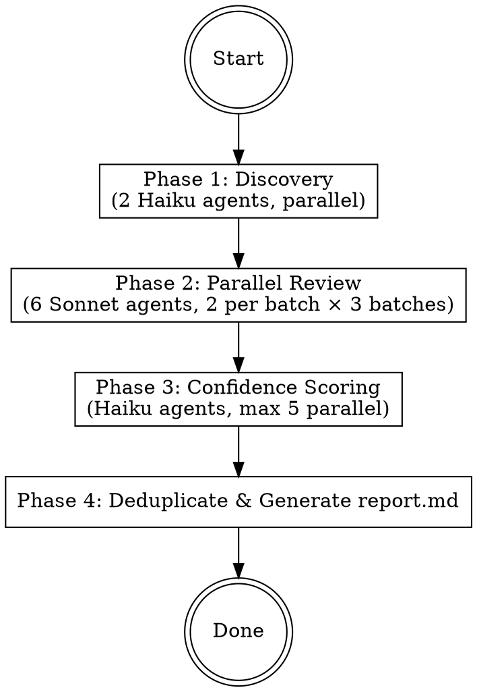

# Go Code Review

Read-only multi-agent **full-project** code review for Go projects. Finds bugs, vulnerabilities, and logic errors. Outputs `report.md` in Chinese to the target project directory.

**CRITICAL: This skill is READ-ONLY. NEVER modify any source code. Only produce `report.md`.**

**Scope:** This skill performs **full-project review** (all Go source files). It is NOT designed for incremental/PR-level review.

## Input

`[PROJECT_PATH]` = the Go project root directory (contains `go.mod`). This is the user-specified project path or current working directory. The `report.md` will be written to this directory. For monorepos with multiple `go.mod` files, review only the module at the specified path.

## Severity Classification

| Level | Code | Scope | Examples |
|-------|------|-------|----------|
| **Critical** | C01, C02... | Data loss, security breach, production crash, data corruption | SQL injection, RCE, nil deref in hot path |
| **High** | H01, H02... | Resource leaks, data races, logic bugs likely hit in practice | Goroutine leak, unprotected shared map, unclosed connections |
| **Medium** | M01, M02... | Potential issues under specific conditions | Error context lost, unsafe rand for tokens, missing timeout |
| **Low** | L01, L02... | Minor issues, unlikely edge cases | Ignored error on Close(), suboptimal string building |
| **Optimize** | O01, O02... | Architecture/API improvements, NOT bugs | God objects, fat interfaces, global state |

**Security severity rule:** All exploitable security vulnerabilities (injection, RCE, auth bypass, data exposure) are **at least High**, regardless of trigger probability. If exploitable remotely or leads to data breach → **Critical**.

## Execution Flow



**Agent execution:** Use the `Agent` tool with `subagent_type: "general-purpose"` and set `model` parameter to `"haiku"` or `"sonnet"` as specified. For parallel agents, include multiple Agent tool calls in a **single message**.

---

### Phase 1: Discovery (2 Haiku Agents, Parallel)

Launch **2 Haiku agents in parallel** (single message, 2 Agent tool calls):

**Agent D1 - File Discovery:**

```
In the project directory [PROJECT_PATH], find all Go source files (*.go).

EXCLUDE:
- vendor/ directory
- testdata/ directory
- Files matching: *_gen.go, *.pb.go, *_generated.go, mock_*.go, *_string.go, *_enumer.go, zz_generated.*.go, wire_gen.go
- Files containing the comment "// Code generated" followed by "DO NOT EDIT" in the first 3 lines
- Files in ent/ directory (generated ORM code)

SEPARATE test files (*_test.go) from source files in output.

Also find any CLAUDE.md files in the project tree.

Return output in this exact format:
---
CLAUDE_MD_FILES:
- path/to/CLAUDE.md (or "none")

SOURCE_FILES (by package):
pkg/server:
  - pkg/server/server.go
  - pkg/server/handler.go
cmd/api:
  - cmd/api/main.go

TEST_FILES (by package):
pkg/server:
  - pkg/server/server_test.go

TOTAL: [N] source files, [M] test files, [P] packages
---
```

**Agent D2 - Project Summary:**

```
In the project directory [PROJECT_PATH], analyze the Go project structure:
- Read go.mod for module name and Go version
- List direct dependencies (from go.mod require block)
- Identify main packages (contain func main), library packages, internal packages
- Note key frameworks/libraries (gin, echo, gRPC, sqlx, gorm, ent, wire, fx, etc.)
- Count total Go files and packages

Return output in this exact format:
---
MODULE: example.com/myapp
GO_VERSION: 1.21
MAIN_PACKAGES: cmd/api, cmd/worker
INTERNAL_PACKAGES: internal/auth, internal/db
KEY_FRAMEWORKS: gin, sqlx, zap
SCALE: [N] files, [P] packages
DEPENDENCIES: (list top 10 direct deps)
---
```

---

### Phase 2: Parallel Review (6 Sonnet Agents, 2 Per Batch)

Using the file list and project summary from Phase 1, launch review agents in **3 sequential batches of 2 parallel agents each** (Batch 1 → wait → Batch 2 → wait → Batch 3).

**Large project handling (50+ source files):** If the project has 50+ source files, assign each agent only the packages most relevant to its review category instead of all files. Heuristics for package assignment:
- **R1 (Correctness):** All packages — correctness issues can occur anywhere
- **R2 (Concurrency):** Packages importing `sync`, `context`, or spawning goroutines
- **R3 (Error Handling):** All packages — error handling is universal
- **R4 (Security):** Packages with `net/http`, `database/sql`, `os/exec`, `io`, user-facing APIs
- **R5 (Observability):** Packages with `log`, `slog`, `zap`, HTTP handlers, main packages
- **R6 (Architecture):** All packages — architecture review needs full picture

Each agent should still receive the full project summary and file list for cross-reference context.

**Test file handling:** Review agents should review `*_test.go` files with relaxed rules:
- `context.Background()` in tests is acceptable
- Hardcoded test data values are acceptable
- `panic`/`t.Fatal` in tests is acceptable
- BUT: data races, resource leaks, and security issues in test code are still flagged (at reduced severity, usually Low)

**CLAUDE.md integration:** If CLAUDE.md files were found in Phase 1, include their content in each review agent's prompt. Agents should flag violations of CLAUDE.md rules alongside standard checklist items.

Each agent returns issues in this format:

```
ISSUES:
---
- file: path/to/file.go
  lines: L10-L15
  category: correctness
  suggested_severity: critical
  title: Nil pointer dereference on HTTP response
  description: |
    http.Get may return nil resp when err != nil.
    defer resp.Body.Close() on line 12 will panic.
  code_context: |
    resp, _ := http.Get(u)
    defer resp.Body.Close() // panics if resp is nil
  suggestion: |
    Check error before accessing resp:
    resp, err := http.Get(u)
    if err != nil { return err }
    defer resp.Body.Close()
---
```

**Batch 1 (Parallel — R1 + R2):**

**Agent R1 - Correctness & Safety** (model: sonnet):

Read Go source files from Phase 1. Focus on issues causing panic, resource leaks, undefined behavior, or state inconsistency. Use the checklist below; for code examples of each pattern, read `review-checklist.md` section 1 from the skill directory.

Checklist:
- goroutine lifecycle: Is every goroutine's exit path guaranteed? Orphaned goroutines?
- `context.Context`: Passed correctly? Cancellation propagated? `context.Background()` where parent context should be?
- `defer`: Loop capture bugs? Execution order issues? Deferred calls on nil receivers?
- error handling: Error silently discarded (`_ = err`)? Error overwritten before checking? Errors swallowed in deferred functions?
- zero values: Zero-value assumptions safe? Nil map/slice/channel used without init?
- pointers: Nil pointer dereference? Shared mutable state without sync? Returning pointers to loop variables?
- `io.Closer`: All properly closed? `resp.Body.Close()` deferred after nil check?
- type assertions: Unchecked type assertions that could panic?

**Agent R2 - Concurrency & Performance** (model: sonnet):

Read Go source files from Phase 1. Evaluate concurrency safety and runtime efficiency. Apply Go memory model reasoning. Use the checklist below; for code examples of each pattern, read `review-checklist.md` section 2 from the skill directory.

Checklist:
- data races: Shared variables accessed from multiple goroutines without sync?
- mutex/RWMutex: Lock/Unlock pairing? Deferred unlock? RWMutex where appropriate? Lock contention?
- channels: Could block indefinitely? Unbuffered in wrong context? Closed channel safety? Channel leak?
- goroutine leaks: Never exit? Missing done/quit channel? Spawned in loops without bounds?
- unbounded goroutine creation: Missing semaphore/worker pool? `go func()` in request handlers?
- hot path allocations: Unnecessary allocs in tight loops? String concat in loops?
- `sync.Map` misuse: Used where regular map+mutex is simpler?
- unbounded queues/buffers: Channels or slices that grow without limit?

**Batch 2 (Parallel — R3 + R4):**

**Agent R3 - Error Handling** (model: sonnet):

Read Go source files from Phase 1. Evaluate whether failures are correctly modeled and propagated. Use the checklist below; for code examples, read `review-checklist.md` section 3 from the skill directory.

Checklist:
- silent failures: Functions return error but callers ignore it?
- lost error context: `return err` without wrapping?
- error wrapping: `%w` used correctly? Double wrapping? Wrapping with `%v` instead of `%w`?
- sentinel errors: Compared with `==` instead of `errors.Is`?
- `errors.Is`/`errors.As`: Used correctly? Custom types implement `Unwrap()`?
- panic as control flow: `panic` for non-fatal errors? Missing `recover` in goroutines?

**Agent R4 - Security** (model: sonnet):

Read Go source files from Phase 1. Identify security vulnerabilities. **Assume all external input is untrusted.** Exploitable vulnerabilities are **at least High; remotely exploitable = Critical**. Use the checklist below; for code examples, read `review-checklist.md` section 4 from the skill directory.

Checklist:
- input validation: User input passed directly without validation?
- injection risks: SQL injection (string concat vs parameterized)? Command injection (`os/exec` with user input)? Path traversal?
- randomness: `math/rand` for security-sensitive operations? Should use `crypto/rand`.
- hardcoded secrets: API keys, passwords, tokens in source code?
- file/network operations: Permissions too permissive? HTTP client without timeout? `InsecureSkipVerify: true`?
- TLS/crypto: Weak ciphers? Deprecated hashes (MD5/SHA1 for security)? Improper key management?

**Batch 3 (Parallel — R5 + R6):**

**Agent R5 - Observability** (model: sonnet):

Read Go source files from Phase 1. Evaluate production operability. **Issues from this agent should be High, Medium, or Low severity only** (not Critical or Optimize). Use the checklist below; for code examples, read `review-checklist.md` section 5 from the skill directory.

Checklist:
- missing logs: Critical operations (startup, shutdown, connection, auth) without logging?
- structured logging: Using `fmt.Printf`/`log.Printf` instead of structured logger?
- excessive logging: Logging in hot paths? Debug logs in production code?
- context in logs: Request ID, trace ID propagated?
- metrics/tracing: Key operations lack timing/counting?
- sensitive data leaks: Passwords, tokens, PII logged?

**Agent R6 - Architecture & API Design** (model: sonnet):

Read Go source files from Phase 1. Focus on long-term maintainability. **All issues from this agent are Optimize (O) level only.** Use the checklist below; for code examples, read `review-checklist.md` section 6 from the skill directory.

Checklist:
- single responsibility: Functions/types doing too much?
- over-abstraction: Unnecessary interfaces with single implementation?
- interface purpose: Defined by implementor instead of consumer? Fat interfaces?
- abstraction leaks: Internal details exposed through public API?
- package boundaries: Clear separation? Circular dependencies?
- global state: Package-level mutable variables? `init()` with side effects?
- Go idioms: Accept interfaces, return structs? Functional options? Error patterns?

---

### Phase 3: Confidence Scoring (Haiku Agents, Max 5 Parallel)

Collect all issues from Phase 2. For each issue, launch a **Haiku agent** to score confidence. Run in batches of **max 5 agents in parallel** until all issues are scored.

**Scoring Prompt Template:**

```
Score this Go code review issue on confidence (0-100).

Issue: [TITLE + DESCRIPTION]
File: [FILE PATH]:[LINES]
Category: [CATEGORY]
Suggested severity: [SEVERITY]
Code context:
[CODE SNIPPET]

Project CLAUDE.md rules (if any):
[CLAUDE.md CONTENT or "No CLAUDE.md found"]

Scoring rubric:
- 0: False positive. Doesn't stand up to scrutiny.
- 25: Might be real, but could be false positive. Unverified.
- 50: Verified real issue, but a nitpick or rarely hit in practice.
- 75: Highly likely real. Will be hit in practice. Directly impacts functionality.
- 100: Definitely real, will happen frequently. Evidence directly confirms.

Disqualifiers (score 0 if ANY apply):
- Issue would be caught by Go compiler (type errors, syntax)
- Issue would be caught by `go vet` or `staticcheck` with default configuration
- Code has a comment explaining why it's written this way (intentional)
- For CLAUDE.md violations: the CLAUDE.md doesn't actually mention this rule

For Optimize-level items: If suggestion is not genuinely impactful for maintainability, score 25.

Return ONLY: { "score": N, "reasoning": "one sentence" }
```

**Filtering thresholds:**
- **Critical/High issues**: Keep if score >= 75
- **Medium/Low issues**: Keep if score >= 80
- **Optimize issues**: Keep if score >= 60

---

### Phase 4: Deduplicate & Generate Report

**Deduplication:** Before generating the report, merge issues that reference the same code location and describe the same root cause (e.g., R1 finds nil deref and R3 finds ignored error on the same line). Keep the higher severity and combine descriptions.

**Report generation:** Write `report.md` to `[PROJECT_PATH]/report.md` using the template from `report-template.md`.

- ALL report content in Chinese (中文), code snippets remain in English
- Use `file_path:L[start]-L[end]` format for code references
- Include at least 2 lines of context before and after problematic code
- Increment issue codes within each severity: C01, C02... H01, H02...
- If no issues remain after filtering: write a short report stating no significant issues found, including project info and review summary

---

## Red Flags - You Are Doing It Wrong

- Modifying any source code file → **STOP**. This is read-only review.
- Skipping confidence scoring → **STOP**. False positives waste developer time.
- Not using multi-agent parallel review → **STOP**. Sequential review misses cross-cutting issues.
- Outputting report in English → **STOP**. Report must be in Chinese.
- Marking architecture issues as bugs → **STOP**. Architecture goes to Optimize (O) only.
- Running `go build` or `go test` → **STOP**. Build/test will run in CI separately.
- Reviewing generated files (`*.pb.go`, `DO NOT EDIT`) → **STOP**. Skip generated code.
- Flagging test-specific patterns (hardcoded test data, `t.Fatal`) as bugs → **STOP**. Relax rules for test files.

## Quick Reference

| Phase | Agents | Model | Parallelism |
|-------|--------|-------|-------------|
| 1. Discovery | D1, D2 | Haiku | 2 parallel |
| 2. Review | R1-R6 | Sonnet | 2 parallel per batch, 3 batches |
| 3. Scoring | S1-Sn | Haiku | Max 5 parallel per batch |
| 4. Report | Main agent | - | Sequential |

| Category | Severity Range | Agent |
|----------|---------------|-------|
| Correctness & Safety | C, H, M, L | R1 |
| Concurrency & Performance | C, H, M, L | R2 |
| Error Handling | C, H, M, L | R3 |
| Security | C, H, M, L (min H for exploitable) | R4 |
| Observability | H, M, L | R5 |
| Architecture & API | O only | R6 |
