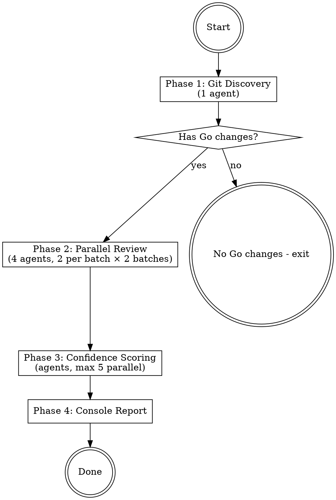

# Git Review Go

Read-only multi-agent review for **uncommitted Go code changes**. Reviews only modified/added code from `git diff`, not the entire project. Outputs report directly to console in Chinese.

**CRITICAL: This skill is READ-ONLY. NEVER modify any source code. NEVER write any files. Output report to console ONLY.**

**Scope:** Reviews uncommitted changes (staged + unstaged). For full-project review, use `codereview-go` instead.

## Input

`[PROJECT_PATH]` = the Go project root directory (contains `go.mod`). Defaults to current working directory.

## Severity Classification

| Level | Code | Scope | Examples |
|-------|------|-------|----------|
| **Critical** | C01, C02... | Data loss, security breach, production crash | SQL injection, RCE, nil deref in hot path |
| **High** | H01, H02... | Resource leaks, data races, logic bugs | Goroutine leak, unprotected shared map |
| **Medium** | M01, M02... | Potential issues under specific conditions | Error context lost, missing timeout |
| **Low** | L01, L02... | Minor issues, unlikely edge cases | Ignored error on Close(), suboptimal patterns |

**Security severity rule:** All exploitable security vulnerabilities are **at least High**. Remotely exploitable → **Critical**.

## Execution Flow



**Agent execution:** Use the `Agent` tool for all sub-agents and **do not set `model`**. Sub-agents must inherit the active main-session model (for example: main session `gpt-5.3-codex` -> sub-agents `gpt-5.3-codex`). For parallel agents, include multiple Agent tool calls in a **single message**.

---

### Phase 1: Git Discovery (1 Agent)

Launch **1 agent**:

**Agent G1 - Git Diff Discovery:**

```
In the project directory [PROJECT_PATH], gather information about uncommitted Go code changes:

1. Run: git diff HEAD --name-only --diff-filter=ACMR -- '*.go'
   This lists all changed/added Go files (staged + unstaged).

2. Run: git diff HEAD -- '*.go'
   This gets the full unified diff of all Go changes.

3. Run: git diff --cached --name-only -- '*.go'
   This identifies which files are staged (ready to commit).

4. Read go.mod for module name, Go version, and key dependencies.

EXCLUDE from review:
- vendor/ directory files
- testdata/ directory files
- Generated files: *_gen.go, *.pb.go, *_generated.go, mock_*.go, *_string.go, *_enumer.go, zz_generated.*.go, wire_gen.go
- Files in ent/ directory

For each changed Go file, also read the FULL file content (not just the diff) so reviewers have context.

Also find any CLAUDE.md files in the project tree.

Return output in this exact format:
---
CLAUDE_MD_FILES:
- path/to/CLAUDE.md (or "none")

MODULE: example.com/myapp
GO_VERSION: 1.21
KEY_FRAMEWORKS: gin, sqlx, zap (from go.mod)

STAGED_FILES:
- path/to/staged.go

ALL_CHANGED_FILES:
- path/to/file1.go (modified)
- path/to/file2.go (added)

DIFF:
[full unified diff output]

FILE_CONTENTS:
=== path/to/file1.go ===
[full file content]
=== path/to/file2.go ===
[full file content]

TOTAL: [N] changed Go files ([M] staged, [K] unstaged)
---
```

**If no Go files changed:** Output "No uncommitted Go changes found." and stop.

---

### Phase 2: Parallel Review (4 Agents, 2 Per Batch)

Using the diff, file contents, and project context from Phase 1, launch review agents in **2 sequential batches of 2 parallel agents each**.

**CRITICAL RULE: Only report issues in CHANGED code.** Agents must cross-reference the diff to ensure every reported issue is in a line that was added or modified. Do NOT report pre-existing issues in unchanged code.

**Test file handling:** `*_test.go` files reviewed with relaxed rules:
- `context.Background()` in tests is acceptable
- Hardcoded test data is acceptable
- `panic`/`t.Fatal` in tests is acceptable
- BUT: data races, resource leaks, and security issues in test code are still flagged (at reduced severity)

**CLAUDE.md integration:** If CLAUDE.md files were found, include their content in each review agent's prompt. Flag CLAUDE.md violations alongside standard issues.

Each agent returns issues in this format:

```
ISSUES:
---
- file: path/to/file.go
  lines: L10-L15
  category: correctness
  suggested_severity: critical
  title: Nil pointer dereference on HTTP response
  description: |
    http.Get may return nil resp when err != nil.
    defer resp.Body.Close() on line 12 will panic.
  code_context: |
    resp, _ := http.Get(u)
    defer resp.Body.Close() // panics if resp is nil
  suggestion: |
    Check error before accessing resp:
    resp, err := http.Get(u)
    if err != nil { return err }
    defer resp.Body.Close()
---
```

**Batch 1 (Parallel — R1 + R2):**

**Agent R1 - Correctness, Concurrency & Safety:**

```
Review ONLY the changed Go code (from the diff). You have the full file contents for context, but ONLY report issues in changed/added lines.

Focus on issues causing panic, resource leaks, data races, or undefined behavior:

Correctness:
- goroutine lifecycle: Every goroutine's exit path guaranteed?
- context.Context: Passed correctly? Cancellation propagated?
- defer: Loop capture bugs? Execution order issues? Deferred calls on nil receivers?
- zero values: Nil map/slice/channel used without init?
- pointers: Nil pointer dereference? Returning pointers to loop variables?
- io.Closer: All properly closed? resp.Body.Close() deferred after nil check?
- type assertions: Unchecked type assertions that could panic?

Concurrency:
- data races: Shared variables accessed from multiple goroutines without sync?
- mutex: Lock/Unlock pairing? Deferred unlock?
- channels: Could block indefinitely? Channel leak?
- goroutine leaks: Never exit? Missing done/quit channel?
- unbounded goroutine creation: Missing semaphore/worker pool?
```

**Agent R2 - Error Handling & Security:**

```
Review ONLY the changed Go code (from the diff). You have the full file contents for context, but ONLY report issues in changed/added lines.

Error Handling:
- silent failures: Error ignored with _ or not checked?
- lost error context: return err without wrapping?
- error wrapping: %w used correctly? %v instead of %w?
- sentinel errors: Compared with == instead of errors.Is?
- panic as control flow: panic for non-fatal errors?

Security (exploitable = at least High, remotely exploitable = Critical):
- input validation: User input passed without validation?
- injection: SQL injection? Command injection? Path traversal?
- randomness: math/rand for security-sensitive operations?
- hardcoded secrets: API keys, passwords, tokens in source?
- file/network: HTTP client without timeout? InsecureSkipVerify?
```

**Batch 2 (Parallel — R3 + R4):**

**Agent R3 - Observability:**

```
Review ONLY the changed Go code (from the diff). You have the full file contents for context, but ONLY report issues in changed/added lines.

Issues should be High, Medium, or Low severity only:
- missing logs: Critical operations without logging?
- structured logging: fmt.Printf/log.Printf instead of structured logger?
- excessive logging: Logging in hot paths?
- sensitive data leaks: Passwords, tokens, PII logged?
- context in logs: Request ID, trace ID propagated?
```

**Agent R4 - Architecture & API Design:**

```
Review ONLY the changed Go code (from the diff). You have the full file contents for context, but ONLY report issues in changed/added lines.

All issues from this agent are suggestions only (not bugs):
- single responsibility: New functions/types doing too much?
- interface design: Fat interfaces? Defined by implementor instead of consumer?
- package boundaries: New code respecting package separation?
- global state: New package-level mutable variables? init() with side effects?
- Go idioms: Accept interfaces, return structs? Functional options?

NOTE: Only report architectural concerns that are clearly impactful. Do not nitpick style preferences.
```

---

### Phase 3: Confidence Scoring (Agents, Max 5 Parallel)

Collect all issues from Phase 2. For each issue, launch a **scoring agent** to score confidence. Run in batches of **max 5 agents in parallel**.

**Scoring Prompt Template:**

```
Score this Go code review issue on confidence (0-100).

Issue: [TITLE + DESCRIPTION]
File: [FILE PATH]:[LINES]
Category: [CATEGORY]
Suggested severity: [SEVERITY]
Code context:
[CODE SNIPPET]

Project CLAUDE.md rules (if any):
[CLAUDE.md CONTENT or "No CLAUDE.md found"]

CRITICAL CHECK: Is this issue actually in a CHANGED line (from git diff)? If the issue is in unchanged/pre-existing code, score 0.

Scoring rubric:
- 0: False positive, or issue is in unchanged code.
- 25: Might be real, but could be false positive.
- 50: Verified real issue, but a nitpick or rarely hit.
- 75: Highly likely real. Will be hit in practice.
- 100: Definitely real, evidence directly confirms.

Disqualifiers (score 0 if ANY apply):
- Issue is in code that was NOT changed in this diff
- Issue would be caught by Go compiler
- Issue would be caught by go vet or staticcheck
- Code has a comment explaining why it's written this way

Return ONLY: { "score": N, "reasoning": "one sentence" }
```

**Filtering thresholds:**
- **Critical/High issues**: Keep if score >= 75
- **Medium/Low issues**: Keep if score >= 80
- **Architecture suggestions**: Keep if score >= 60

---

### Phase 4: Console Report

**Deduplication:** Merge issues that reference the same code location and same root cause. Keep higher severity and combine descriptions.

**Output the report directly to console** using the format below. Do NOT write any files.

All report content must be in Chinese; code snippets remain in English.

**Console Report Format:**

The template below is intentionally in Chinese because the final console output must be Chinese.

````markdown
# Git Review Go 审查报告

## 变更概览

| 项目 | 值 |
|------|-----|
| **项目路径** | [PROJECT_PATH] |
| **模块名称** | [MODULE_NAME] |
| **审查时间** | [TIMESTAMP] |
| **变更文件数** | [CHANGED_FILE_COUNT] |
| **暂存文件数** | [STAGED_FILE_COUNT] |

## 问题概览

| 等级 | 数量 | 说明 |
|------|------|------|
| **Critical** | [N] | 可导致数据丢失、安全漏洞、生产环境崩溃 |
| **High** | [N] | 资源泄露、数据竞争、大概率触发的逻辑错误 |
| **Medium** | [N] | 特定条件下可能触发的潜在问题 |
| **Low** | [N] | 低概率边界情况 |

## [SEVERITY] 级别问题

### [CODE]: [问题标题]

- **文件**: `path/to/file.go:L[start]-L[end]`
- **类别**: [类别名]
- **置信度**: [score]

**问题描述**
[详细说明]

**问题代码**
```go
[代码片段]
```

**修复建议**
[修复方案 + 代码]

---

## 审查说明

- 本审查仅针对未提交的代码变更（git diff HEAD）
- 已排除自动生成文件和 vendor 目录
- 已排除预先存在的问题，仅审查变更/新增代码
- 置信度低于阈值的问题已被过滤
- 跨 Agent 重复发现的同一问题已合并去重
````

If no issues remain after filtering, output:

```
# Git Review Go 审查报告

> **审查结果：未发现高置信度问题。** 变更代码质量良好，未检出超过置信度阈值的 Bug 或安全漏洞。可以放心提交。
```

---

## Red Flags - You Are Doing It Wrong

- Modifying any source code file → **STOP**. This is read-only review.
- Writing report to a file → **STOP**. Output to console only.
- Reporting issues in unchanged code → **STOP**. Only review changed lines.
- Skipping confidence scoring → **STOP**. False positives waste developer time.
- Setting explicit `model` on sub-agents → **STOP**. Always inherit the main-session model.
- Outputting report in English → **STOP**. Report must be in Chinese.
- Marking architecture suggestions as bugs → **STOP**. Architecture is suggestion only.
- Reviewing generated files → **STOP**. Skip generated code.

## Quick Reference

| Phase | Agents | Model Policy | Parallelism |
|-------|--------|-------|-------------|
| 1. Git Discovery | G1 | Inherit main-session model | 1 agent |
| 2. Review | R1-R4 | Inherit main-session model | 2 parallel per batch, 2 batches |
| 3. Scoring | S1-Sn | Inherit main-session model | Max 5 parallel per batch |
| 4. Report | Main agent | - | Sequential, console output |

| Category | Severity Range | Agent |
|----------|---------------|-------|
| Correctness, Concurrency & Safety | C, H, M, L | R1 |
| Error Handling & Security | C, H, M, L (min H for exploitable) | R2 |
| Observability | H, M, L | R3 |
| Architecture & API | Suggestion only | R4 |
